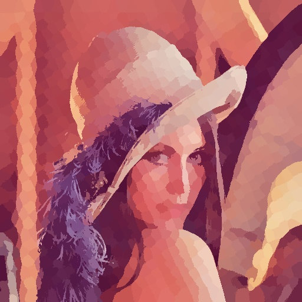
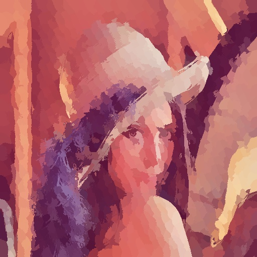
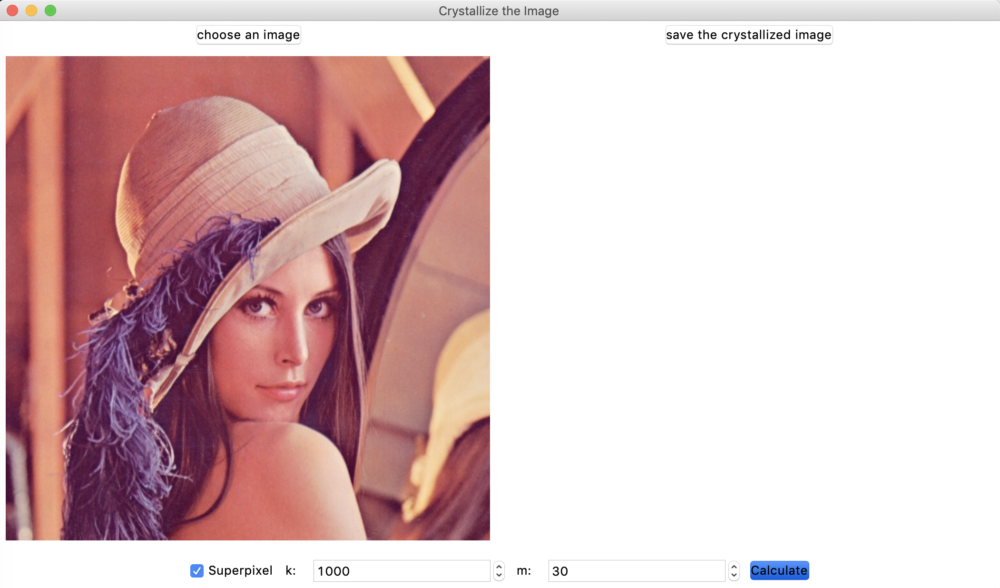
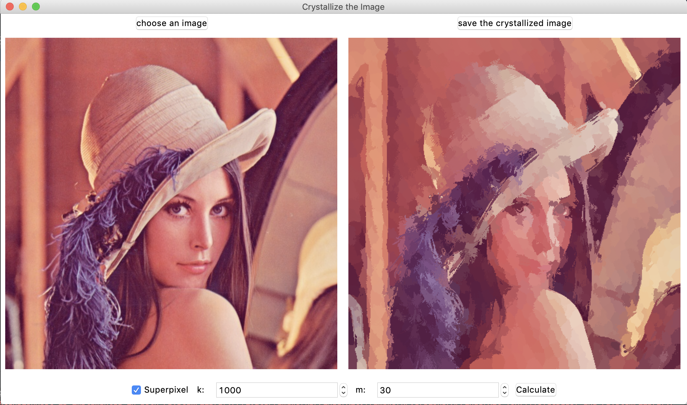

# Report for Image Filter Project

Author: ...

## 实验目标

实现一个图像滤镜。

本项目基于python-opencv实现了晶格化效果(Crystalize)滤镜（参考Adobe Photoshop CC 2018 晶格化效果滤镜），最终可以分别使用命令行/用户图形界面查看滤镜效果。

## 具体算法

根据作业说明ppt中的提示，我使用了超像素分割来实现晶格化滤镜。

我实现SLIC算法对图像进行超像素分割。因为最后需要生成晶格化图像，我在超像素中心初始化和图像显示部分进行了修改。

具体步骤如下[1]:

[[1\]]: https://www.kawabangga.com/posts/1923	"SLIC算法分割超像素原理及Python实现"

1. 接受输入K（超像素个数）和计算“距离”的参数M（决定在聚类计算中像素位置距离所占的比例，M越大，超像素越紧密）。计算超像素初始边长$block\_length = \sqrt{ total\_pixels / K}$。
2. 将K个超像素中心分布到图像的像素点上。由于我想要模仿PS中晶格化滤镜的效果，我在这一步里将超像素中心交错排列：上下两行和左右两列超像素中心分别错开半个超像素边长。
3. 微调超像素中心C的位置。在以C为中心的3x3范围内，移动中心点至9个点中梯度最小（这里使用Laplacian梯度）的点。这样是为了避免超像素落到噪点或者边界上。
4. 初始化数据。用数组label保存每一个像素点属于哪个超像素。dis数组保存像素点到它属于的那个超像素中心的“距离”。
5. 对于每一个超像素中心C，在它2 x block_length范围内的点：如果点到超像素中心C的“距离”（5维）小于这个点到它原来属于的超像素中心的距离，那么说明这个点属于超像素C。更新dis，更新label，更新超像素中包含的像素点坐标。“距离“ = $d_{lab} + \frac{m}{block\_length} \times d_{xy}$, 其中$d_{lab} = \sqrt{(l_1 - l_2)^2 + (a_1 - a_2)^2 + (b_1 - b_2)^2}$, $d_{xy} = \sqrt{(x_1 - x_2)^2 + (y_1 - y_2)^2}$.
6. 对每一个超像素中心，重新计算它的距离。
7. 重复以上5.6.两步。论文[2]中提到该算法在10步左右收敛。因此重复次数一般设置为10。

论文[2]中算法伪代码如下：

[[2\]]: https://infoscience.epfl.ch/record/177415	"SLIC Superpixels Compared to State-of-the-art Superpixel Methods"

```tex
Algorithm 1 SLIC superpixel segmentation 

/∗ Initialization ∗/
Initialize cluster centers Ck = [lk , ak , bk , xk , yk]T by sampling pixels at regular grid steps S. 
Move cluster centers to the lowest gradient position in a 3 × 3 neighborhood. 
Set label l(i) = −1 for each pixel i. Set distance d(i) = ∞ for each pixel i. 

repeat 
	/∗ Assignment ∗/
	for each cluster center Ck do 
    	for each pixel i in a 2S × 2S region around Ck do 
 			Compute the distance D between Ck and i.
 			if D < d(i) then 
 				set d(i) = D 
 				set l(i) = k 
 			end if 
		end for
	end for 
	/∗ Update ∗/
	Compute new cluster centers. 
	Compute residual error E. 
until E ≤ threshold 
```

观察：超像素分割和晶格化滤镜效果（由Adobe Photoshop软件晶格化效果滤镜）不同，但是后者可以由超像素分割通过设定一定范围的参数得到。

区别：超像素分割会在最大程度上保留颜色轮廓，从而保留图像细节，进行成功分割。而晶格化滤镜不会保留颜色轮廓，也不会保留太多图像细节，但是会在相近区域进行颜色聚类。

简而言之，在超像素分割算法中，当初始像素中心交叉分布，设定一个较大的m值（50～500），并且聚类循环1次，一般来说容易得到晶格化效果图片。为了演示超像素分割和晶格化滤镜效果的区别，我写了一个GUI方便使用者自行探索。

例子：

原图：


晶格化效果(循环次数1，k=1000, m=50)：



超像素分割(循环次数10， k=1000, m=50)：



## 运行环境配置

环境：python 3.6

库：opencv, numpy, tkinter, Pillow

如果在运行GUI时遇到

`[TKWindow setCanCycle:]: unrecognized selector sent to instance 0x<code>`

请参考：https://www.python.org/download/mac/tcltk/ 和 https://github.com/cztomczak/cefpython/issues/306

解决办法：换一个虚拟环境

## 程序运行步骤

### 1. 命令行

在打开了正确环境的命令行中输入

```bash
python main.py --image <str: filename> --k <int: number of clusters> --m <int: balancing param>
```

参数：

image: 输入图片路径 + 图片名

k: 聚类中心个数

m: 平衡参数，该值越小，距离衡量中

默认:

```bash
filename = "Lena.jpg", k = 1000, m = 30
```

会在当前目录下生成`_new_0.jpg ~ _new_9.jpg`10张循环过程图像，每生成一张命令行输出对应循环次数。

晶格化滤镜结果为`_new_0.jpg`, SLIC超像素结果为`_new_9.jpg`.

生成`_new_0.jpg`大概需要1分钟。生成全部10张图像大概需要9分钟。

### 2. GUI

在打开了正确环境的命令行中输入

```bash
python gui.py
```

会显示如下页面：


左上角按钮选择合适图片文件之后，具体页面如下：



勾选Superpixel，程序会完成10次循环进行超像素分割，否则进行1次循环得到晶格化效果。

`k: `标签后微调框可以设定k值，`m: `标签后微调框可以设定m值。点击`Calculate`按钮进行计算。

超像素分割过程会生成`new_0.jpg ~ new_9.jpg`10张循环过程图像，晶格化效果则仅生成`new_0.jpg`过程图像。每生成一张命令行输出对应循环次数。

晶格化效果计算耗时大致为1分钟，超像素分割耗时大致为9分钟。

目标图片计算完成后，界面右侧显示生成结果：



点击右上角`save the crystallized image`按钮保存图片至`output<#>.jpg`, <#>部分根据程序运行后保存次数而定，并且在命令行中输出提示。

## 未来工作

此部分基于“想实现但没来得及”心态写成。

由于使用python-opencv而非C++中的opencv，实现的SLIC算法效率较低。

实际上关于SLIC算法的实现效率，已经有博客[3]

[[3\]]: https://www.cnblogs.com/Imageshop/p/6193433.html	"超像素经典算法SLIC的代码的深度优化和分析"

讨论过这个问题，可以在原本论文的基础上再进行加速。

未来工作：提高算法效率，使用C++重写算法，并使用博客[3]方法进行加速。

## 遇到的问题

1. 不知道晶格化效果选用什么算法比较合适。用SLIC算是生搬硬凑（？）。
2. python-opencv resize函数参数中目标大小应该写成`(width, height)`, 而不是image.shape得到的`height, width`顺序。

## 参考资料

[1]. laixintao(2017). "SLIC算法分割超像素原理及Python实现" https://www.kawabangga.com/posts/1923 

[2]. [Achanta, Radhakrishna](https://infoscience.epfl.ch/search?f1=author&as=1&sf=title&so=a&rm=&m1=e&p1=Achanta%2C%20Radhakrishna&ln=en) ; [Shaji, Appu](https://infoscience.epfl.ch/search?f1=author&as=1&sf=title&so=a&rm=&m1=e&p1=Shaji%2C%20Appu&ln=en) ; [Smith, Kevin](https://infoscience.epfl.ch/search?f1=author&as=1&sf=title&so=a&rm=&m1=e&p1=Smith%2C%20Kevin&ln=en) ; [Lucchi, Aurélien](https://infoscience.epfl.ch/search?f1=author&as=1&sf=title&so=a&rm=&m1=e&p1=Lucchi%2C%20Aur%C3%A9lien&ln=en) (2012). "SLIC Superpixels Compared to State-of-the-art Superpixel Methods"[DOI: [10.1109/TPAMI.2012.120](http://dx.doi.org/10.1109/TPAMI.2012.120)]: https://infoscience.epfl.ch/record/177415

[3]. Imageshop(2016). 超像素经典算法SLIC的代码的深度优化和分析. https://www.cnblogs.com/Imageshop/p/6193433.html 

